```{r meta, echo=FALSE}
library(metathis)
meta() %>%
  meta_general(
    description = "First Steps in Learning the Use of Git and GitHub in RStudio",
    generator = "xaringan and remark.js"
  ) %>% 
  meta_name("github-repo" = "MounaBelaid/First-Steps-in-Learning-the-Use-of-Git-and-GitHub-in-RStudio") %>% 
  meta_social(
    title = "First Steps in Learning the Use of Git and GitHub in RStudio",
    url = "",
    image = "",
    image_alt = paste(
      "Title slide of First Steps in Learning the Use of Git and GitHub in RStudio",
      "Workshop delivered by Mouna Belaid"
      ),
    og_type = "website",
    og_author = "Mouna Belaid",
    twitter_card_type = "summary_large_image",
    twitter_creator = "@mounaa_belaid"
  )
```

```{r setup, include = FALSE}
options(htmltools.dir.version = FALSE)
library(knitr)
library(xaringanExtra)
library(icons)
# set default options
opts_chunk$set(echo=TRUE,
               collapse = TRUE,
               fig.width = 7.252,
               fig.height = 4,
               dpi = 300)

# set engines
knitr::knit_engines$set("markdown")

xaringanExtra::use_tile_view()
xaringanExtra::use_panelset()
xaringanExtra::use_clipboard()
xaringanExtra::use_webcam()
xaringanExtra::use_broadcast()
xaringanExtra::use_share_again()
xaringanExtra::style_share_again(
  share_buttons = c("twitter", "linkedin", "facebook")
)
```

class: title-slide, center, top
background-image: url(img/git_github.png)
background-position: 90% 75%, 75% 75%
background-size: 20%, contain

.right-column[
# `r rmarkdown::metadata$title`
### `r rmarkdown::metadata$subtitle`

**`r rmarkdown::metadata$author`**<br>
`r rmarkdown::metadata$date`
]

---
name: about-me
layout: false
class: about-me-slide, inverse, middle, center

# About me


## Mouna Belaid

### Business Intelligence Consultant<br>Prime Analytics - Paris, France<br>Organizer of R-Ladies Paris

[`r icons::fontawesome("link")`mounabelaid.netlify.app/](https://mounabelaid.netlify.app/)
[`r icons::fontawesome("twitter")`@mounaa_belaid](https://twitter.com/mounaa_belaid)
[`r icons::icon_style(icons::fontawesome("github"), scale = 1)` @MounaBelaid](https://github.com/MounaBelaid)
[`r icons::icon_style(icons::fontawesome("youtube"), scale = 1)` Mouna Belaid](https://www.youtube.com/channel/UCID33pDULsQg2y4FVlv4CnQ)

---
layout: true

<a class="footer-link" href="https://bit.ly/3ESdN6U">bit.ly/3ESdN6U; Mouna Belaid</a>

<!-- this adds the link footer to all slides, depends on footer-link class in css-->
---

# Session Outline

.pull-left[
1) Overview of Version Control, benefits of version control, and popular version control systems

2) What is Git?

3) What is GitHub?

4) Getting the most out of GitHub and Git
  - Connect a new RStudio project started from scratch to GitHub
  - Learn about GitHub fundamentals
  - Clone an existing GitHub Repository to an RStudio Project
  - Make commits
]

.pull-right[

5) Submission of a new Cheatsheet to the ["Cheatsheets" GitHub Repository](https://github.com/rstudio/cheatsheets) maintained by RStudio
]

---

# Requirements

--
template: requirements

.pull-left-narrow[
.center[]]
.pull-right-wide[### .black[R and RStudio installed]]

--

.pull-left-narrow[
.center[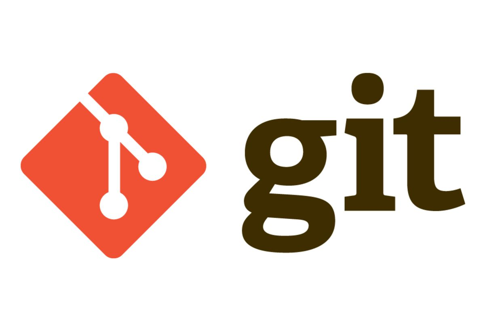]]
.pull-right-wide[### .black[Git installed]]

--

.pull-left-narrow[
.center[`r icons::icon_style(icons::fontawesome("github"), scale = 2)`]]
.pull-right-wide[### .black[Free GitHub account]]

---

name: question
class: inverse, middle, center

{{content}}

---
template: question

`r icons::icon_style(icons::fontawesome("question-circle"), scale = 3, fill = "white")`
# What is version control?

---

## What is version control?

.panelset[
.panel[.panel-name[Definition]
.pull-left[
Version control, also known as **source control**, is the practice of tracking and managing changes to software code.

Version control systems are software tools that help software teams manage changes to source code over time. 
]
.pull-right[
.center[

<font size="-0.5"> The Turing Way project illustration by Scriberia. Used under a CC-BY 4.0
licence. DOI: <a href="https://doi.org/10.5281/zenodo.3332807">10.5281/zenodo.3332807</a> </font>
]
]
] 

.panel[.panel-name[Benefits of version control]
.pull-left[
- A complete .my-red[long-term] change history of every file

- Branching and merging

- Ability to make your work more .my-red[reproducible]
]

.pull-right[
.center[
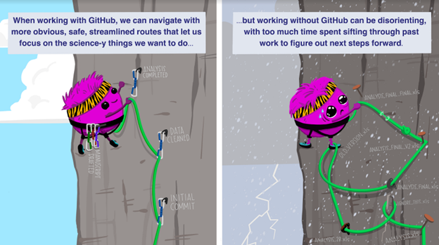
<font size="-0.5"> GitHub illustrated series by Allison Horst and Julie Lowndes.
A collaboration around open science, coding, teaching, and art.
<a href="https://www.openscapes.org/blog/2022/05/27/github-illustrated-series/">openscapes.org/blog/2022/05/27/github-illustrated-series/</a> </font>
]
]

]

???

Notes

.panel[.panel-name[Popular Version Control Systems]
.center[
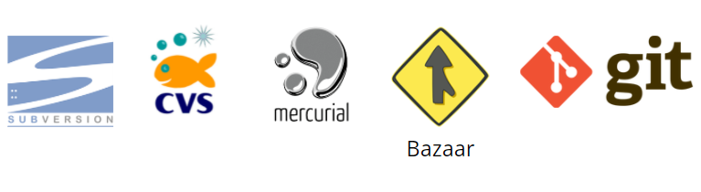
]
] 
]

???

Notes

---
template: question

`r icons::icon_style(icons::fontawesome("question-circle"), scale = 3, fill = "white")`
# What is Git?

---

## What is Git?

--

.pull-left-narrow[
.center[]]
.pull-right-wide[### .black[Git is an open source software for version control, originally developed in 2005 by Linus Torvalds, the creator of the Linux operating system kernel]]

--
.pull-right-wide[### .black[Git is a distributed version control tool to track the changes in the source code of a project]]

--
.pull-right-wide[### .black[Git's key design objectives are functionality, performance, security, and flexibility]]

???

Notes

---
template: question

`r icons::icon_style(icons::fontawesome("question-circle"), scale = 3, fill = "white")`
# What is GitHub?

---

## What is GitHub?

--

.pull-left-narrow[
.center[]]
.pull-right-wide[### .black[GitHub is the most popular hosting service for collaborating on code using Git. Other hosting services include Bitbucket, and Gitlab.]]

--
.pull-right-wide[### .black[GitHub is a collaboration platform.]]

--
.pull-right-wide[### .black[GitHub uses  the most popular open source version control software, to track every contribution and contributor to a defined project.]]

---
.center[
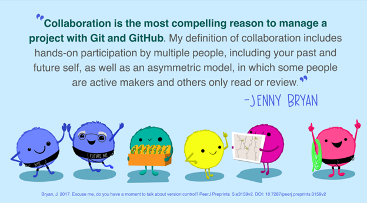
<font size="-0.2"> GitHub illustrated series by Allison Horst and Julie Lowndes.
A collaboration around open science, coding, teaching, and art.
<a href="https://www.openscapes.org/blog/2022/05/27/github-illustrated-series/">openscapes.org/blog/2022/05/27/github-illustrated-series/</a> </font>
]

---
template: question
`r emo::ji("rocket")`
# Getting Started with Git

---

## Getting Started with Git

.panelset[
.panel[.panel-name[Check that Git is installed]
**Step 1.** In	the Terminal of RStudio, enter the following code

```{r, eval=FALSE, echo=TRUE}
which git
```

You can check the version of Git
```{r, eval=FALSE, echo=TRUE}
git --version
```
]

.panel[.panel-name[Communicate with GitHub via HTTPS]
.pull-left[
**Step 2.** Go to [https://github.com/settings/tokens](https://github.com/settings/tokens) and click *Generate token*

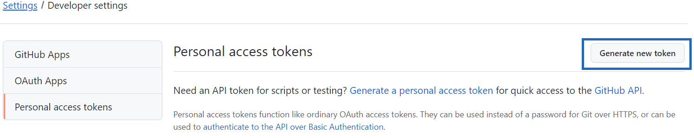

**Step 3.** Copy the generated PAT to your clipboard. Or leave that browser window open and available for a little while, so you can come back to copy the PAT. 
]

.pull-right[
Provide this PAT next time a Git operation asks for your password.

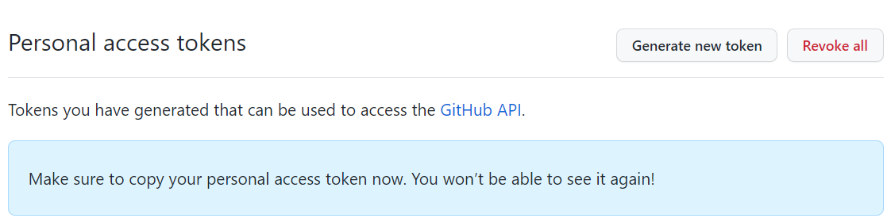
Or, from RStudio, do the following:

```{r, eval=FALSE, echo=TRUE}
usethis::create_github_token()
gitcreds::gitcreds_set()
```

]
]

.panel[.panel-name[Tell Git who you are]
**Step 4.** In RStudio, click *Tools* -> *Shell* and type each line separately:

```{r, eval=FALSE, echo=TRUE}
git config --global user.email "jack.bel@gmail.com" # use your mail address instead
git config --global user.name "jack.bel" # use your GitHub username instead
```
]
]

---
template: question

`r icons::icon_style(icons::fontawesome("check-square"), scale = 3, fill = "white")`
# Getting the most out of GitHub and Git

---

## Getting the most out of GitHub and Git

.panelset[
.panel[.panel-name[1) Create	a	new	RStudio	Project	and	push it	to GitHub]
`r emo::ji("rocket")` **Learning objectives**
               
- Create a new repository on GitHub
             
- Make commits
             
- Link a remote GitHub repository to a local repository
]<!---->

.panel[.panel-name[2) Clone	an	existing	GitHub	Repository	to	an	RStudio	Project]
`r emo::ji("rocket")` **Learning objectives**

- Connect a new RStudio project started from scratch to GitHub

- GitHub fundamentals

- Explore a GitHub repository
] <!---->
] 

---
template: question

`r icons::icon_style(icons::fontawesome("check-square"), scale = 3, fill = "white")`
# GitHub Knowledge Base

---

## GitHub Knowledge Base

.center[
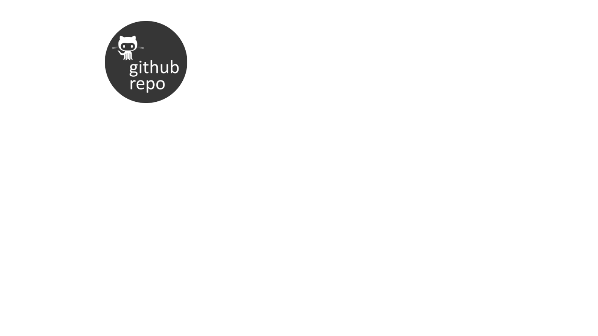
]

---

## GitHub Knowledge Base

.center[
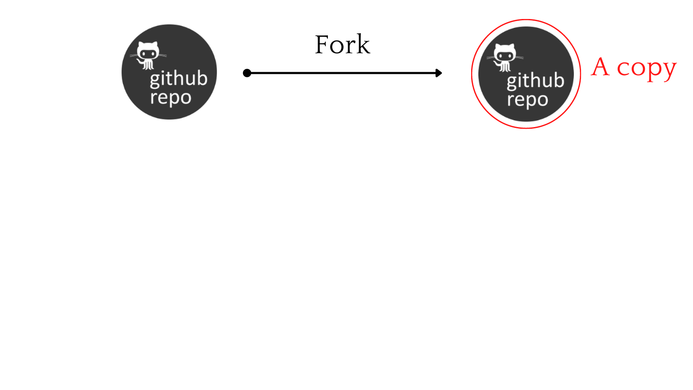
]

---

## GitHub Knowledge Base

.center[
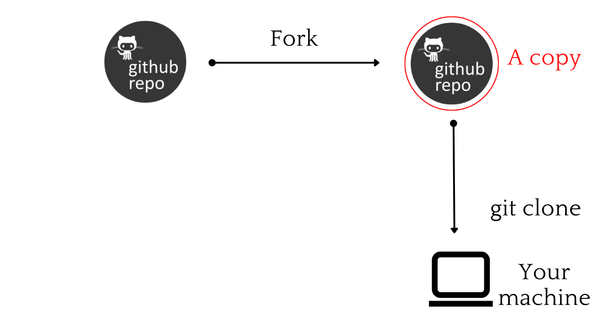
]

---

## GitHub Knowledge Base

.center[
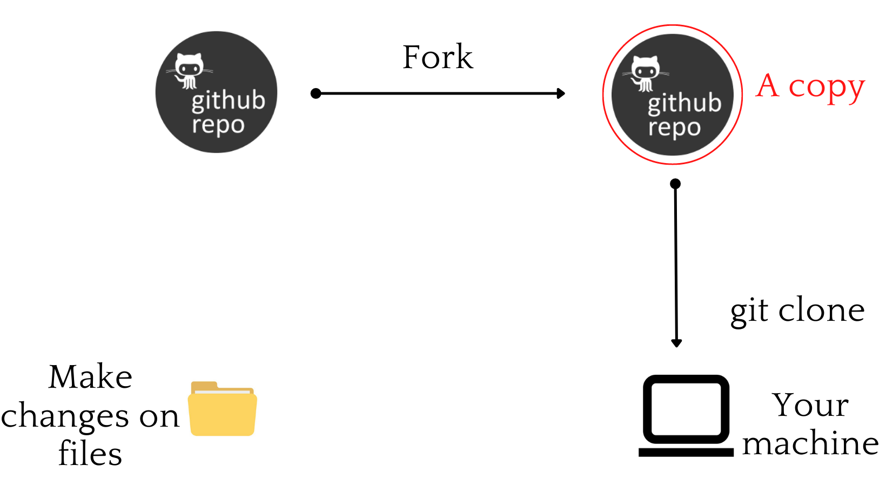
]

---

## GitHub Knowledge Base

.center[
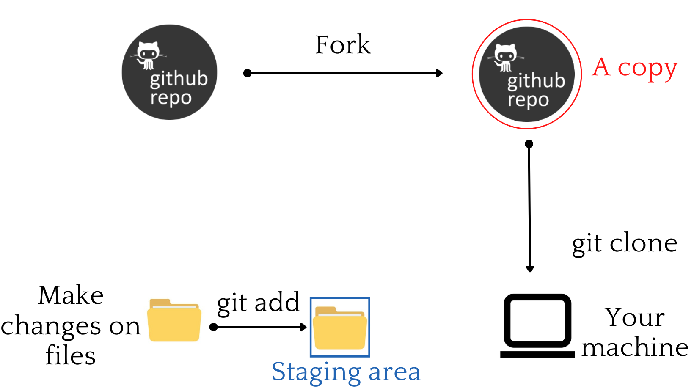
]

---

## GitHub Knowledge Base

.center[
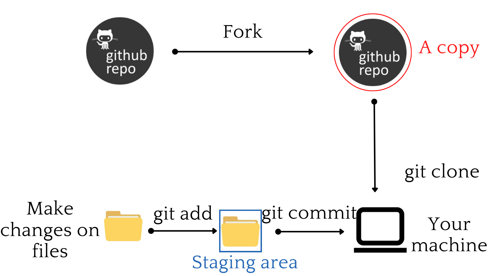
]

---

## GitHub Knowledge Base

.center[
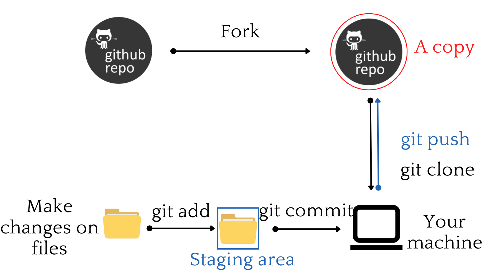
]

---

## GitHub Knowledge Base

.pull-left[
.my-blue[Commands] | .my-blue[Operations]
-------------           | -------------
`git init <directory>`  | Create empty Git repo in specified directory
`git clone <repository>` | Clone a repository located at <repository> your local machine
`git config user.name <username>` | Define author name to be used for all commits in current repository
`git add <directory>` | Stage all changes in <directory> for the next commit
]

.pull-right[
.my-blue[Commands] | .my-blue[Operations]
------------- | -------------
`get commit -m <"message">` | Commit the staged snapshot, but instead of launching a text editor, use <"message"> as the commit message
`get status` | List which files are staged, unstaged, and untracked
`git log` | Display the entire commit history using the default format
]

---

## GitHub Knowledge Base

.my-blue[Commands] | .my-blue[Operations]
------------- | -------------
`git pull <remote>` | Fetch the specified remote’s copy of current branch and immediately merge it into the local copy
`git push <remote> <branch>` | Upload local repository content to a remote repository

**Pull requests** are proposed changes to a repository submitted by a user and accepted or rejected by a repository's collaborators. Like issues, pull requests each have their own discussion forum.

**Issues** are suggested improvements, tasks or questions related to the repository. Issues can be created by anyone (for public repositories), and are moderated by repository collaborators. Each issue contains its own discussion thread.

---

template: question

`r icons::icon_style(icons::fontawesome("check-square"), scale = 3, fill = "white")`
# 1) Create	a	new	RStudio	Project	and	push	it	to	GitHub

---

## 1) Create	a	new	RStudio	Project	and	push	it	to	GitHub

.pull-left[
**Step 1.** In	RStudio	click	*File*	>	*New	Project*	>	*New	Directory* > *New	Project*
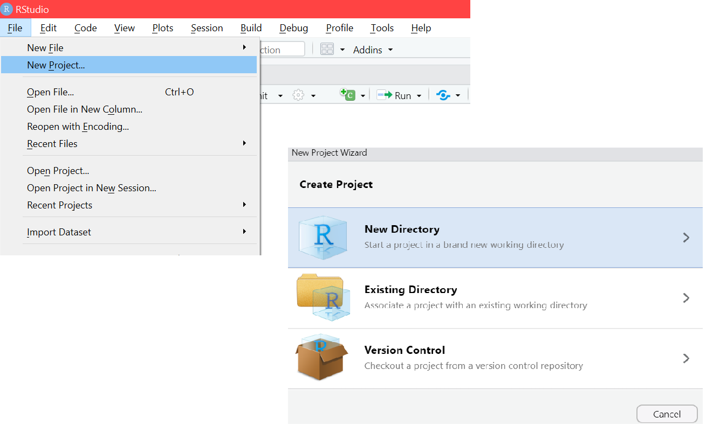
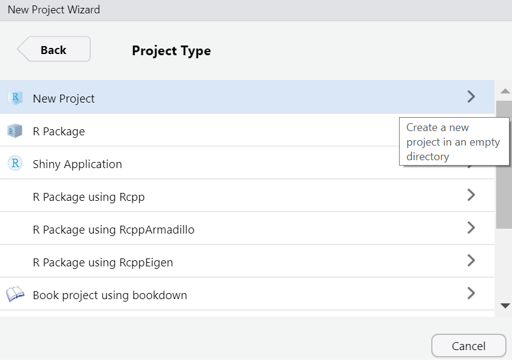
]
.pull-right[
**Step 2.** Give a name to the project in the *Directory name* tab and select	*Create	a	git	repository* then click on *Create Project*
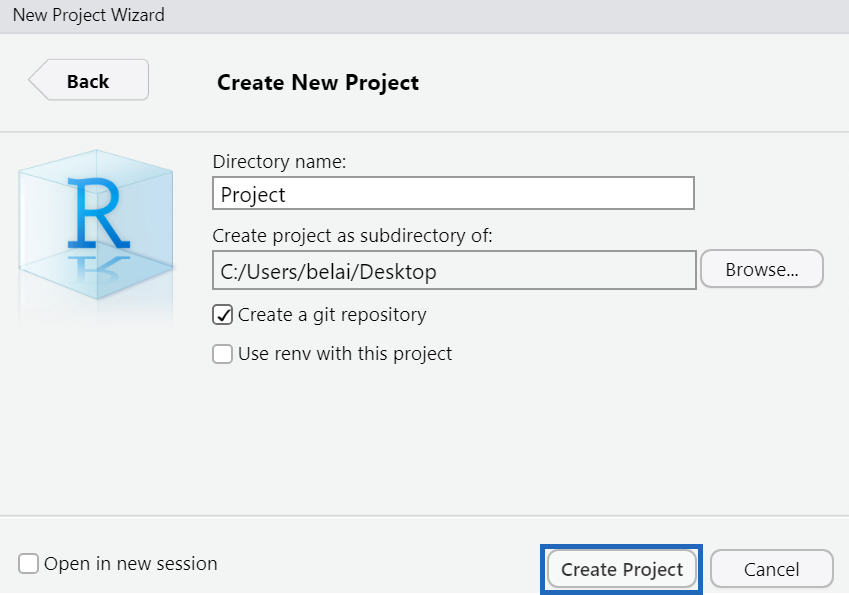
]

---

## 1) Create	a	new	RStudio	Project	and	push	it	to	GitHub

.pull-left[
**Step 3.** Create a new	R script. In the next steps, this script will be	added	to a repository on GitHub by using Git.
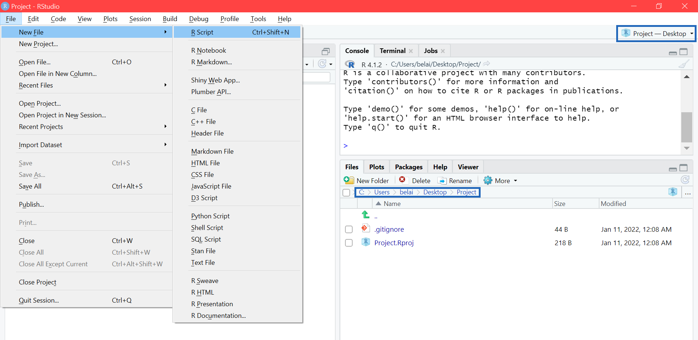
]
.pull-right[
**Step 4.** The *Welcome.R* script is created and is saved in the project directory. It	should also	appear in	the Git tab	next to	the	*Environment*	or the *History*	tab. You need to select	this R script on the Git panel.	
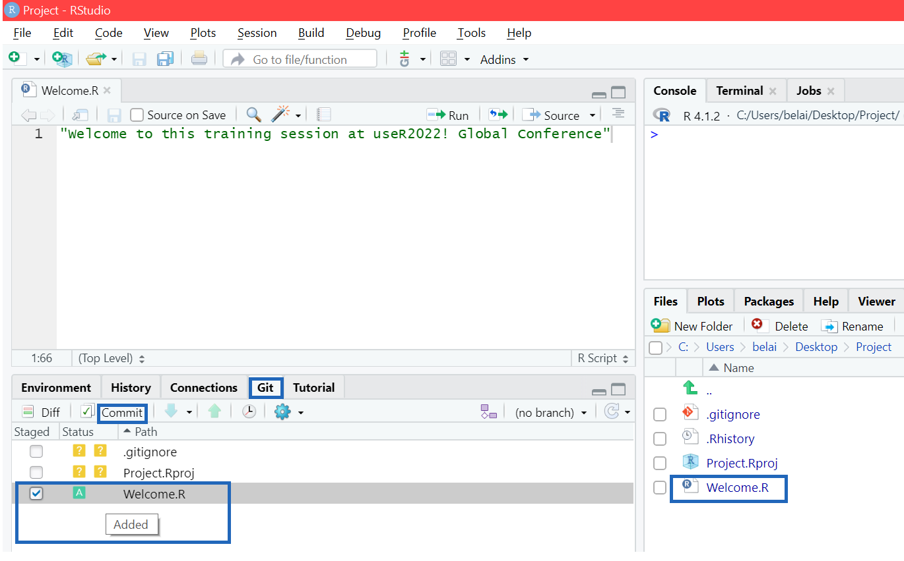
]

---
name: repository
## 1) Create	a	new	RStudio	Project	and	push	it	to	GitHub

.pull-left[
**Step 5.** Now	click *Commit*. A new window is open. Enter	an	identifying	
message	in the *Commit	message* tab.
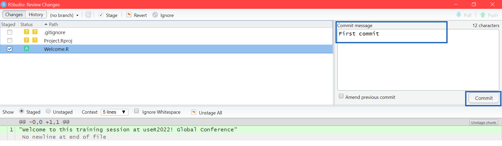
You	have	now	committed	the	current	version	of	this	*Welcome.R* script	to	your	repository	on	your	computer. Now	you	want	to push the	contents	of	this	commit	to	GitHub,	so	it	is	also	backed-up	off	site	and	available to	collaborators.
]
.pull-right[
**Step 6.** Go	to [GitHub](https://github.com/).	Create	a	*New	repository*,	and	name	it
]

---

## 1) Create	a	new	RStudio	Project	and	push	it	to	GitHub

**Step 7.** In the *Terminal* tab, type	the following three lines of code	and	click	enter

```{r, eval=FALSE, echo=TRUE}
git remote add origin https://github.com/MounaBelaid/Test.git # Test is the repository name that I've created on GitHub
git branch -M main
git push -u origin main
```

`r icons::icon_style(icons::fontawesome("star"), color = "#e5bf00")` You	have	now	pushed	your	commit	to	GitHub,	and	should	be	able	to	see	your	files	in	your	GitHub account.	
The *Pull* and *Push* buttons	in	RStudio	will	now	also	work.	

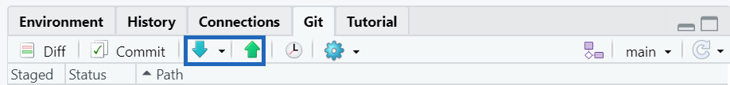

---
template: question

`r icons::icon_style(icons::fontawesome("check-square"), scale = 3, fill = "white")`
# 2) Clone	an	existing	GitHub	Repository	to	an	RStudio	Project

---

## 2) Clone	an	existing	GitHub	Repository	to	an	RStudio	Project

.pull-left[
**Step 1.** In	RStudio	click	*File*	>	*New	Project*	>	*Version Control* > *Git*
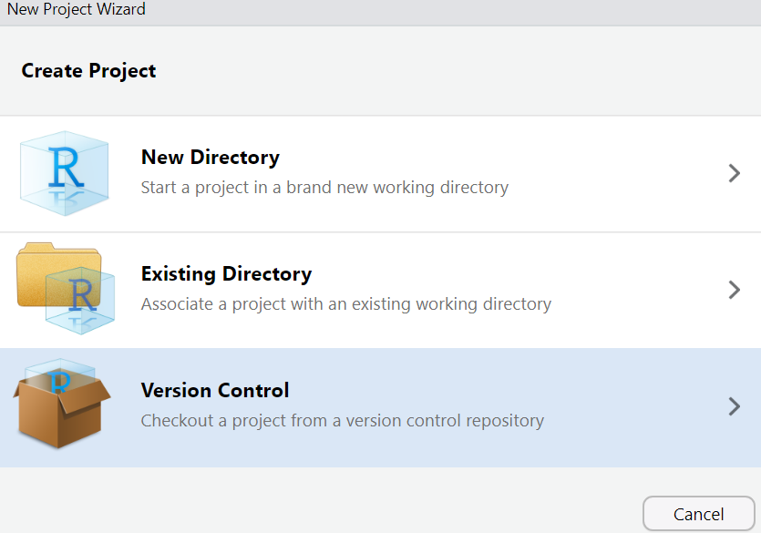
]
.pull-right[
**Step 2.** Go	to	the	Resporitory	on GitHub and	click	on *Code* and make a copy of the  git link in order to clone this repository i.e to get a copy of this existing	Git respository into your local machine.
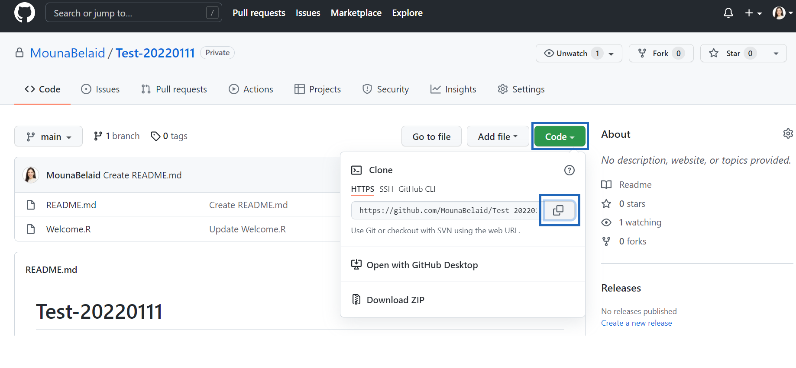
]

---

## 2) Clone	an	existing	GitHub	Repository	to	an	RStudio	Project

**Step 3.** Go back to you R session and enter the link	in *Respository	URL* then click on *Create Project*

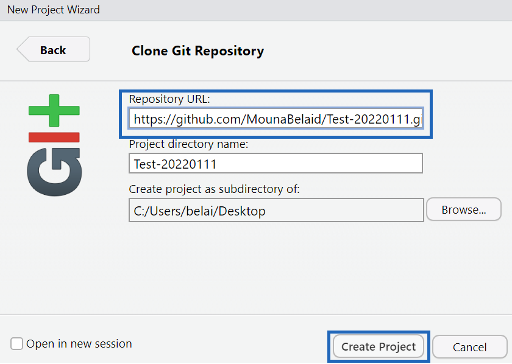

---
template: question

`r icons::icon_style(icons::fontawesome("file"), scale = 3)`
# My Submission of a new Cheatsheet to the "Cheatsheets" GitHub Repository maintained by RStudio

---
name: Cheatsheet
## My Submission of a new Cheatsheet to the "Cheatsheets" GitHub Repository maintained by RStudio: **Volunteer Basis**

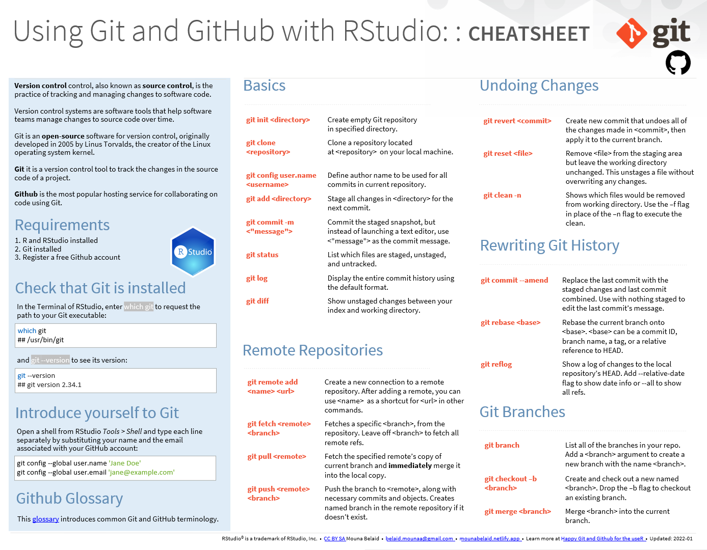

---
name: Cheatsheet
## My Submission of a new Cheatsheet to the "Cheatsheets" GitHub Repository maintained by RStudio: **Volunteer Basis**

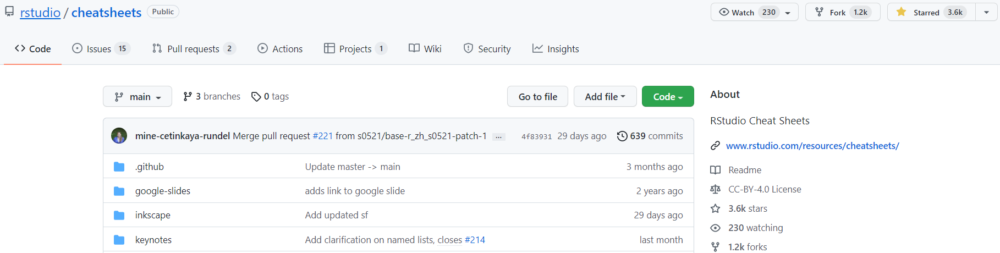
---
name: Cheatsheet
## My Submission of a new Cheatsheet to the "Cheatsheets" GitHub Repository maintained by RStudio: **Volunteer Basis**

.pull-left[
**Step 1.** *Fork* the [repository](https://github.com/rstudio/cheatsheets)
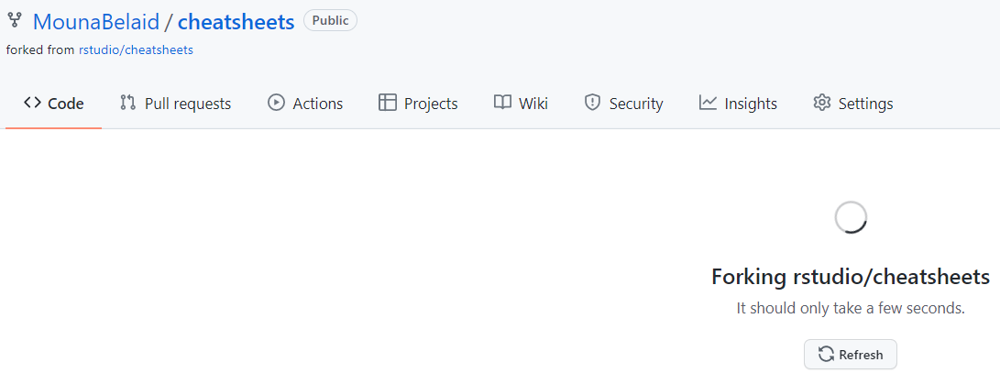
**Step 2.** Clone Git repository
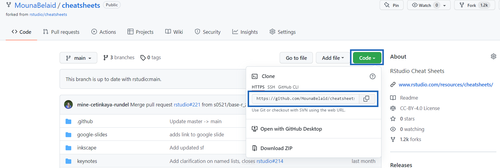
]
.pull-right[
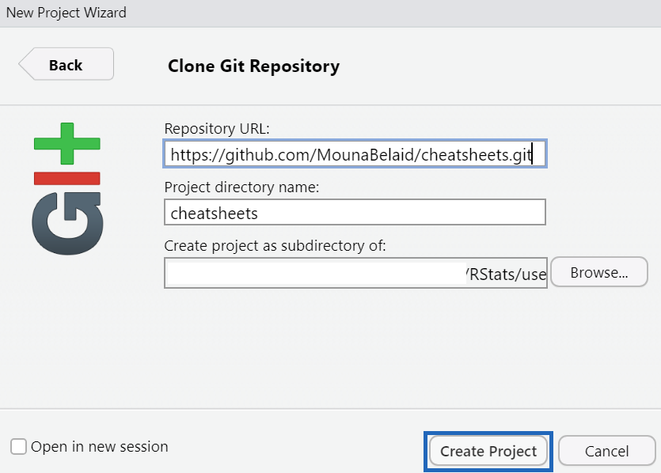
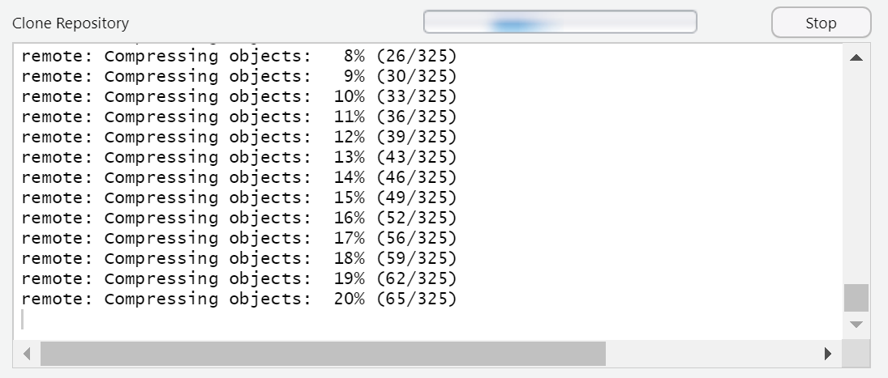
]

---
name: Cheatsheet
## My Submission of a new Cheatsheet to the "Cheatsheets" GitHub Repository maintained by RStudio: **Volunteer Basis**

.pull-left[
**Step 3.** I put the PDF document in the directory where the other PDF cheatsheets are provided
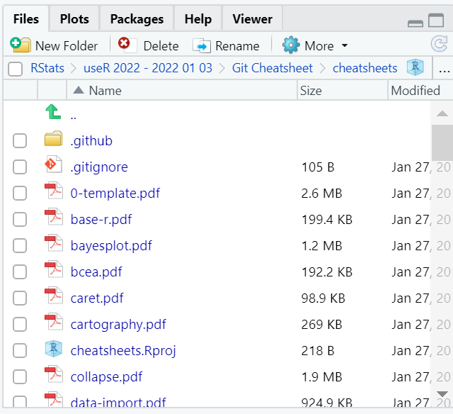
]
.pull-right[
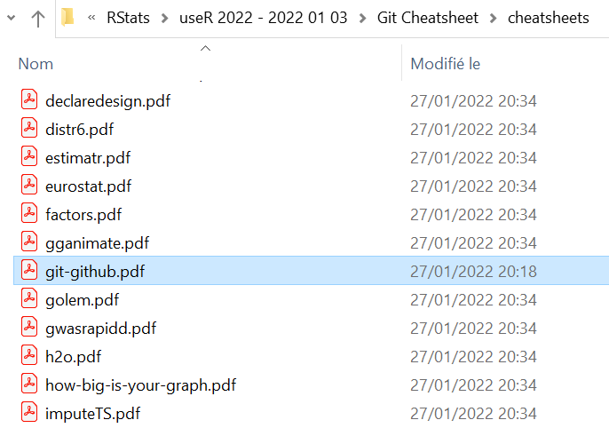
]

---
name: Cheatsheet
## My Submission of a new Cheatsheet to the "Cheatsheets" GitHub Repository maintained by RStudio: **Volunteer Basis**

.pull-left[
**Step 4.** I did the same for the PowerPoint version
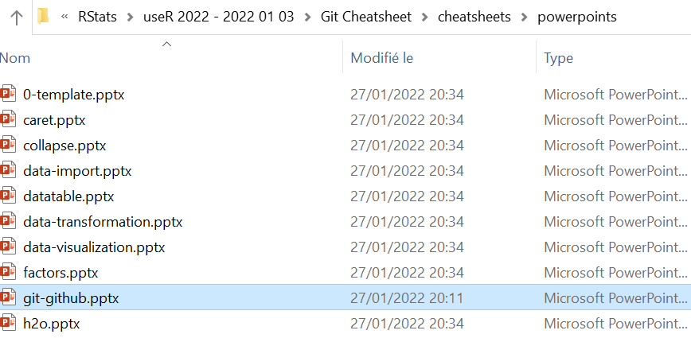
]
.pull-right[
**Step 5.** I included .png image of the first page of the *git-github* cheatsheet
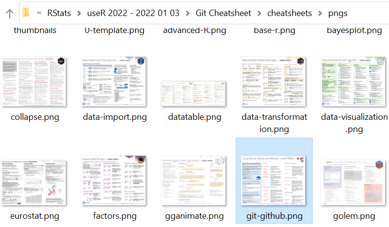
]

---
name: Cheatsheet
## My Submission of a new Cheatsheet to the "Cheatsheets" GitHub Repository maintained by RStudio: **Volunteer Basis**

.pull-left[
**Step 6.** I made a *commit*
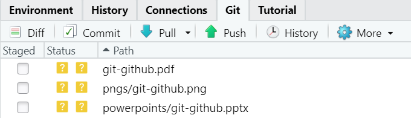
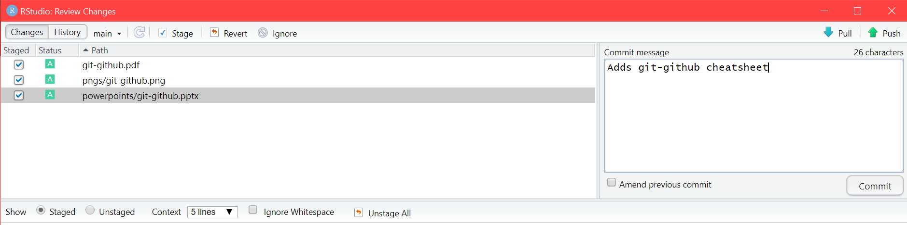
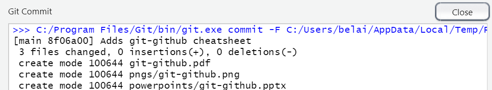
]
.pull-right[
**Step 7.** I created a *pull request*
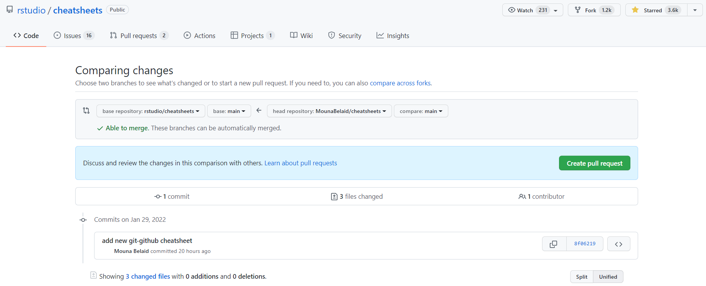
]

---
name: Cheatsheet
## My Submission of a new Cheatsheet to the "Cheatsheets" GitHub Repository maintained by RStudio: **Volunteer Basis**

.pull-left[
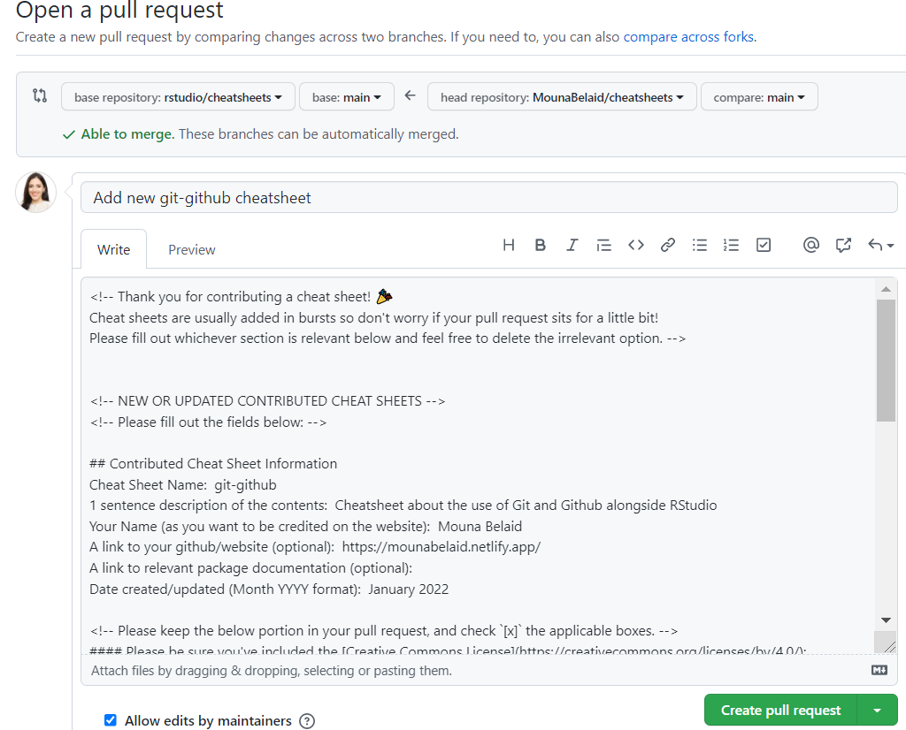
]
.pull-right[
**Step 8.** I provided information about the cheatsheet in the section below
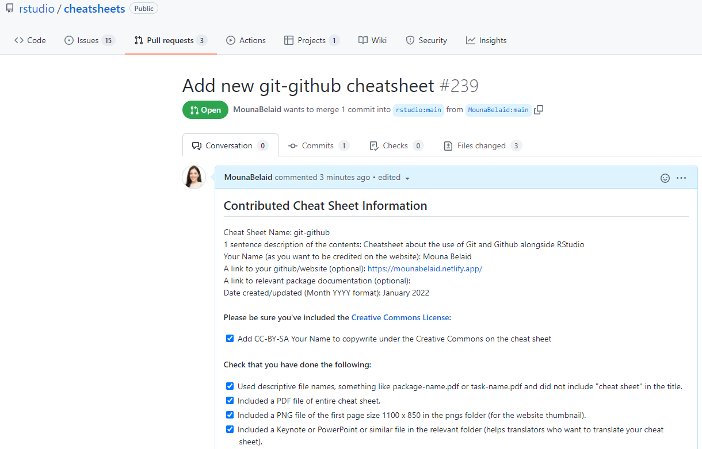
]
---
template: question

`r icons::icon_style(icons::fontawesome("file"), scale = 3)`
# Want to keep learning?

---

name: learning-resources
## Want to keep learning?

- [Happy Git and GitHub for the useR](https://happygitwithr.com/index.html): a book which was written by Jenny Bryan, the STAT 545 TAs, Jim Hester

- [GitHub Docs](https://docs.github.com/en): a full open source documentation provided by GitHub

- [Introduction to GitHub](https://lab.github.com/githubtraining/introduction-to-github): a free course offered by GitHub

---
class: goodbye-slide, inverse, middle, left

.pull-left[

# Thank you!

### Here's where you can find me...

.right[
[mounabelaid.netlify.app/ `r icons::fontawesome("link")`](https://mounabelaid.netlify.app/)<br/>
[@mounaa_belaid `r icons::fontawesome("twitter")`](https://twitter.com/mounaa_belaid)<br/>
[@MounaBelaid `r icons::fontawesome("github")`](https://github.com/MounaBelaid)<br/>
[Mouna Belaid `r icons::fontawesome("youtube")`](https://www.youtube.com/channel/UCID33pDULsQg2y4FVlv4CnQ)<br/>
]]
